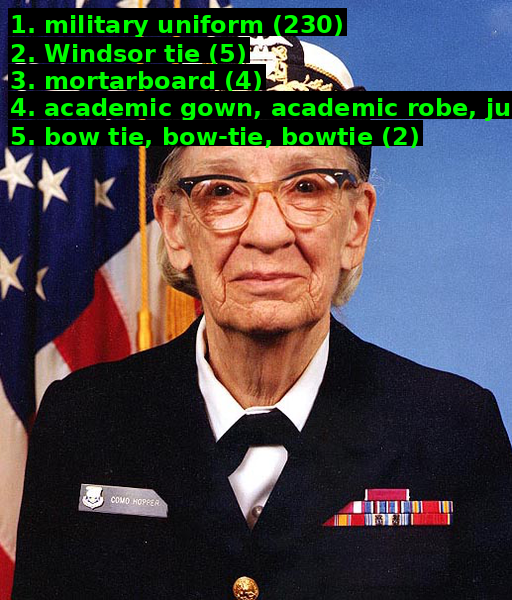
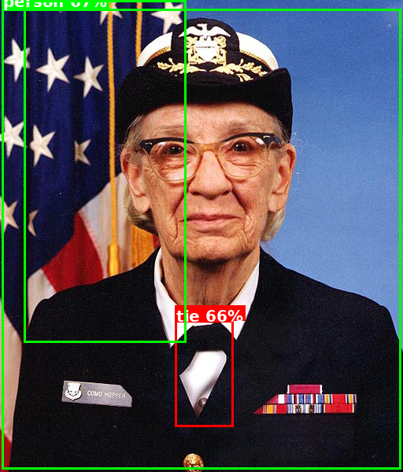
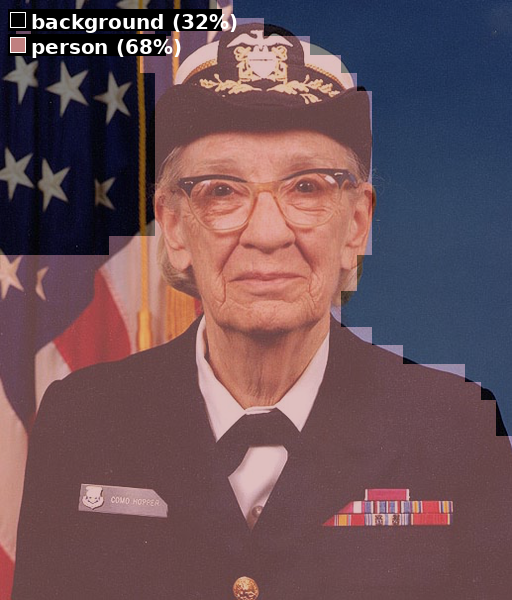
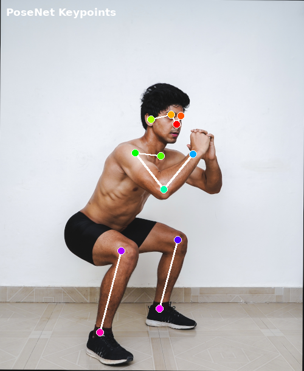
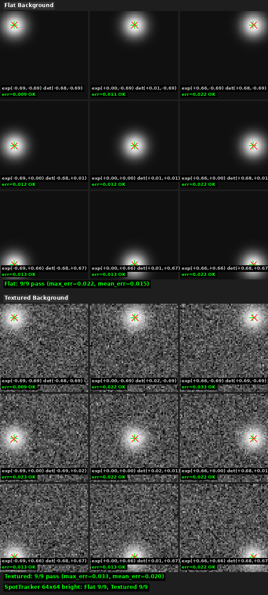
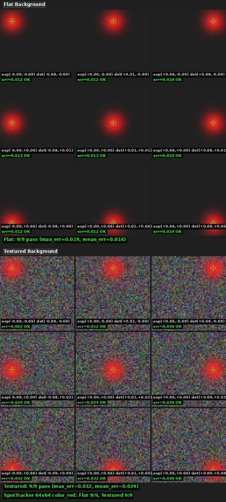
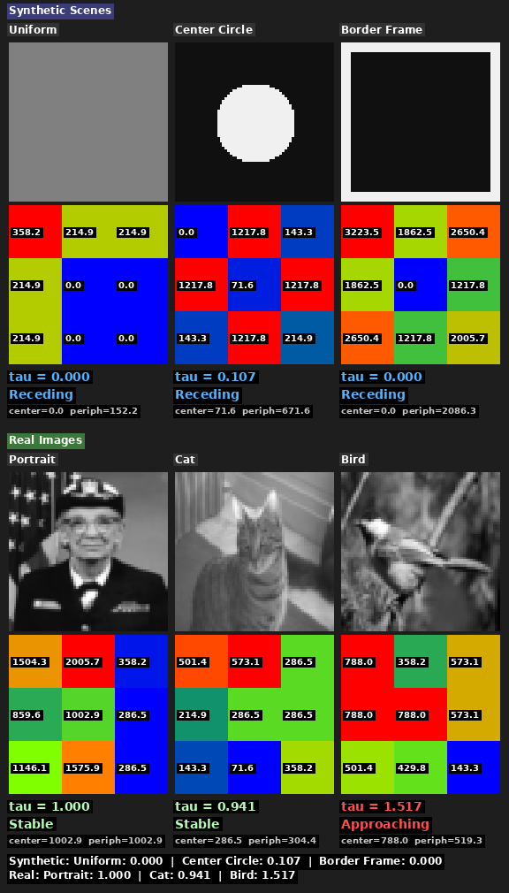
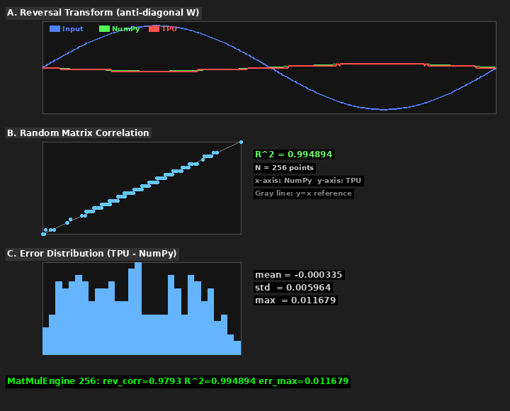

# Visual Proof Tests Guide

libredgetpu ships with 11 visual proof tests that generate annotated output images proving
correct hardware execution. These are **not** pytest tests — they are standalone scripts
that produce human-readable visual evidence of correct behavior.

Two scripts cover the full stack:

| Script | Tests | Focus |
|--------|-------|-------|
| `test_visual.py` | 5 | Standard ML inference (classification, detection, segmentation, pose, multipose) |
| `test_visual_robotics.py` | 6 | Custom robotics modules (spot tracker bright + color, looming, pattern tracker, matmul, optical flow) |

---

## Quick Start

### Prerequisites

- USB Coral Edge TPU plugged in
- `Pillow` installed (`pip install Pillow`)
- For ML inference tests: internet connection (models auto-download from the model zoo)
- For robotics tests: no downloads needed (synthetic inputs)

### Run all tests

```bash
# ML inference (downloads ~100 MB of models on first run)
python -m tests.test_visual

# Robotics modules (no downloads)
python -m tests.test_visual_robotics
```

### Run individual tests

```bash
# ML inference — pick specific models
python -m tests.test_visual --models classification detection segmentation pose

# Robotics — pick specific modules
python -m tests.test_visual_robotics --models spot_tracker spot_tracker_color looming pattern_tracker matmul optical_flow
```

### Output location

All images are saved to `tests/results/` (git-ignored). Each run overwrites previous
results for the same test.

---

## ML Inference Tests (`test_visual.py`)

These tests run standard computer vision models from the
[EdgeTPUModelZoo](https://github.com/ricardodeazambuja/EdgeTPUModelZoo) through
`SimpleInvoker` and apply CPU post-processing to produce annotated output images.

---

### Classification — MobileNet V1

**Input**: Any RGB image, resized to 224x224.

**What to look for**:
- Top-5 predicted class labels with confidence percentages overlaid on the image
- The top-1 class should match the dominant subject (e.g., "military uniform" for
  a portrait of Grace Hopper)
- Confidence scores should be reasonable (top-1 typically > 30%)

**Reference output**:



**If something is wrong**:
- All labels show "background" or random classes → quantization mismatch or input
  not properly resized to 224x224
- Confidence scores are all near-equal (~0.4% each) → input is likely all-zeros or
  all-ones; check image loading
- No labels appear → post-processing failed; check that the labels file loaded correctly

---

### Object Detection — SSD MobileDet

**Input**: Any RGB image, resized to 320x320.

**What to look for**:
- Colored bounding boxes around detected objects
- Each box has a class label and confidence percentage at the top edge
- Boxes should tightly frame the objects (not spanning the entire image)
- NMS should prevent heavily overlapping boxes for the same object

**Reference output**:



**If something is wrong**:
- Boxes span the entire image → anchor decoding failed; check that
  `TFLite_Detection_PostProcess` params were read correctly from the model
- Many overlapping boxes on the same object → NMS threshold too high or NMS
  not running (IoU threshold should be ~0.6)
- No detections at all → confidence threshold too high, or model output
  dequantization is wrong
- Boxes are offset from objects → scale factors (y/x/h/w) from the model's
  FlexBuffer params are not being applied

---

### Semantic Segmentation — DeepLabV3

**Input**: Any RGB image, resized to 513x513.

**What to look for**:
- Semi-transparent color overlay on the original image (50% blend)
- Different semantic classes shown in distinct colors (PASCAL VOC palette)
- A legend at the bottom listing detected classes and their pixel percentage
- Person class should cover a significant portion for images with people

**Reference output**:



**If something is wrong**:
- Entire image is one solid color → argmax is returning the same class for all
  pixels; check that the segmentation map has the correct shape
- Colors don't match the legend → palette indexing is off by one
- Legend shows 0% for all classes → the segmentation map is all zeros; check
  `postprocess_deeplabv3()` output
- Overlay looks correct but no legend → Pillow `ImageDraw` issue; check font loading

---

### Pose Estimation — PoseNet

**Input**: Full-body single-person image, resized to 641x481. The test uses `squat.bmp`
for clean skeleton output.

**What to look for**:
- 17 colored keypoint circles at anatomically correct body locations
  (nose, eyes, ears, shoulders, elbows, wrists, hips, knees, ankles)
- White skeleton lines connecting keypoints (COCO skeleton topology)
- Only keypoints with confidence > 0.5 are drawn; at least 5 should appear
  for a clear full-body image
- Keypoint positions should scale correctly to the original image dimensions

**Reference output**:



**If something is wrong**:
- Keypoints are clustered in one corner → coordinate scaling is wrong; check that
  keypoint (y, x) coords are being mapped from model resolution to display resolution
- No skeleton lines → confidence threshold too strict or keypoint indices are wrong
- Keypoints on wrong body parts → the heatmap/offset decoding in `postprocess_posenet()`
  has a bug; check mid-range and short-range offset application
- Only 1-2 keypoints detected → image may not show a clear full-body pose; use
  `squat.bmp` or another single-person full-body image

---

### Multi-Person Pose — MultiPose PoseNet

**Input**: Any RGB image, resized to 257x257 with int8 preprocessing
(`(uint8 - 127).astype(int8)`, then XOR 0x80 for Edge TPU uint8 domain).

**What to look for**:
- Each detected person gets a distinct color (red, green, blue, yellow, etc.)
- 17 keypoint circles and COCO skeleton lines per person
- Only keypoints with confidence > 0.3 are drawn
- Legend shows the total number of detected persons
- For single-person images (Grace Hopper), expect 1 person detected
- For multi-person images, expect multiple colored skeletons

**If something is wrong**:
- No poses detected → int8 preprocessing may be wrong; ensure
  `(int8_vals.view(uint8) ^ 0x80).tobytes()` is used (XOR 0x80 converts int8 to Edge TPU uint8)
- Keypoints at wrong locations → offset or displacement tensor identification
  may be incorrect; check channel count matching (17/34/32/32)
- Only partial skeleton → some keypoints below confidence threshold;
  try lowering `score_threshold` in `postprocess_multipose()`
- ImportError for scipy → install with `pip install scipy` or
  `pip install libredgetpu[multipose]`

---

## Robotics Module Tests (`test_visual_robotics.py`)

These tests use synthetic input scenes (no model zoo downloads) and verify that the
robotics modules produce numerically correct outputs on the Edge TPU hardware.

---

### SpotTracker — Bright (64x64)

Tests the grayscale bright-spot tracker with two background conditions.

**Input**: 9 synthetic 64x64 grayscale images per background, each containing a single
Gaussian dot (radius=6, peak=255) placed at one of 9 grid positions: corners, edges,
and center. Margin = 10 pixels from edges.

- **Flat background** (top half): uniform dark background (value=16). The dot is the
  only bright feature — tests baseline accuracy.
- **Textured background** (bottom half): random Gaussian noise (mean=80, std=30) with
  the bright dot blended on top. Tests robustness to background clutter.

**What to look for**:
- Two stacked 3x3 grids (flat on top, textured on bottom)
- Each cell shows:
  - The input image with the Gaussian dot visible
  - Green `+` crosshair at the **expected** position
  - Red `x` crosshair at the **detected** position
  - Expected and detected offsets in `[-1, +1]` normalized coordinates
  - Error magnitude and PASS/FAIL label
- **Pass criteria**: all 9 positions show PASS (max error < 0.15) per background
- The flat background should achieve 9/9 pass consistently
- The textured background may show slightly higher errors but should still pass;
  the peak=255 dot dominates the noise (peak is ~6 standard deviations above noise mean)

**Reference output**:



**If something is wrong**:
- All detections cluster at center (0, 0) → tracker output is all-zeros; check that
  the model loaded correctly and the Dense layer weights encode coordinate grids
- Detected positions are flipped (x/y swapped) → output channel ordering is wrong
- Flat passes but textured fails everywhere → the softmax temperature may be too low,
  causing noise peaks to compete with the dot; check template's temperature parameter
- Some positions FAIL at edges/corners → quantization clipping at extreme coordinates;
  this was a known bug that was fixed — ensure the latest templates are being used
- Error > 0.15 at a few positions → slight quantization noise is normal for 8-bit;
  check if the pattern is systematic (e.g., all corners fail)

---

### SpotTracker — Color Red (64x64)

Tests the RGB color-selective tracker (`color_red` variant) with two background conditions.
The color tracker uses a 1x1 Conv2D filter with coefficients `[1.0, -0.5, -0.5]` to
amplify red pixels and suppress green/blue before applying soft argmax.

**Input**: 9 synthetic 64x64 RGB images per background, each containing a red Gaussian
dot (color=[255, 32, 32], radius=6) at one of 9 grid positions.

- **Flat background** (top half): uniform dark gray ([32, 32, 32]). After the color
  filter, the red dot produces a strong positive response while the background is near zero.
- **Textured background** (bottom half): random RGB noise (per-channel mean=80, std=30)
  with the red dot blended on top. The color filter suppresses the random-color noise while
  the red dot still dominates.

**What to look for**:
- Same layout as the bright tracker: two stacked 3x3 grids
- Images appear in color (RGB) with red dots visible on dark or noisy backgrounds
- Green `+` at expected positions, red `x` at detected positions
- **Pass criteria**: all 9 positions show PASS (max error < 0.15) per background

**Reference output**:



**If something is wrong**:
- All detections at center → color filter may not be loaded; check that the `color_red`
  template was found and the Conv2D weights are present
- Worse accuracy than bright tracker on flat background → the color filter adds a
  quantization layer; verify `color_weight_scale` in the sidecar JSON
- Textured background fails while flat passes → noise in the red channel is competing
  with the dot; the red-channel noise std after filtering is ~37, vs dot response ~223,
  so this should still work — check dot intensity and noise parameters
- `FileNotFoundError` on template → ensure `color_red` templates are installed:
  `python -m libredgetpu.spot_tracker_gen --sizes 64 --variant color_red`

---

### LoomingDetector (64x64)

Tests collision avoidance via edge density zones, using both synthetic scenes and
real photographs. The detector computes Sobel edge magnitudes in a 3x3 spatial grid,
then derives a tau value (center density / peripheral density) to classify approach.

**Input — Synthetic Scenes** (top section):
- **Uniform**: all pixels = 128 (flat gray, no edges)
- **Center Circle**: dark background (16) with bright disk (240) at center, radius 16
- **Border Frame**: dark center (16) with bright 4-pixel border (240)

**Input — Real Images** (bottom section, auto-downloaded from google-coral/test_data):
- **Portrait** (Grace Hopper): face centered, edges distributed across body/background
- **Cat**: animal face with edges at whiskers/eyes
- **Bird**: bird on branch with varied edge distribution

**What to look for**:
- Two sections stacked vertically: "Synthetic Scenes" and "Real Images"
- Each scene shows:
  - Input image (scaled to 180x180)
  - 3x3 zone heatmap (colored blue → cyan → green → yellow → red by edge density)
  - **Prominent tau value** with colored interpretation:
    red = "Approaching" (tau > 1.1), blue = "Receding" (tau < 0.9),
    green = "Stable" (0.9 <= tau <= 1.1)
  - Center and peripheral mean values
- **Expected tau behavior (synthetic)**:
  - Uniform: tau near 0 (no center edges, some peripheral noise) → Receding
  - Center Circle: low tau (edges at circle boundary, mostly peripheral) → Receding
  - Border Frame: tau = 0 (all edges at periphery, none at center) → Receding
- **Real images**: tau values vary by image content; a bird with center-heavy features
  may show Approaching, while evenly-lit portraits tend toward Stable
- **Zone heatmap colors**: brighter zones (more edges) should be warmer colors (red/yellow)

**Reference output**:



**If something is wrong**:
- All zones show the same color → Sobel edge detection is not working; check that
  Conv2D Sobel kernels are correctly encoded in the model
- Tau is always 1.0 for all scenes → zone density computation is returning uniform
  values; check `compute_tau()` center/peripheral averaging
- Heatmap colors are inverted (edges show blue, flat areas show red) → colormap
  normalization is reversed
- Tau < 0 or NaN → division by zero in tau computation; check that peripheral
  mean has an epsilon guard
- Real images section missing → download failed; check internet connection and that
  `tests/models/` directory is writable

---

### PatternTracker (64x64, 8x8)

Tests template matching via Conv2D correlation with two background conditions.

**Input**: 3 synthetic 64x64 grayscale search images per background, each containing
an 8x8 checkerboard template (alternating 240/16 in 2x2 blocks) placed at:
- Upper-left: pixel position (12, 12)
- Center: pixel position (28, 28)
- Lower-right: pixel position (44, 44)

- **Flat background** (top section): uniform dark background (value=32). The checkerboard
  is the only textured feature — tests baseline correlation accuracy.
- **Textured background** (bottom section): random Gaussian noise (mean=80, std=30) with
  the checkerboard placed on top. Tests robustness to clutter. The high-contrast template
  (range 224) dominates the noise easily.

**What to look for**:
- Two stacked sections (flat on top, textured on bottom)
- Each section has 3 rows, each row showing:
  - Left: the 8x8 checkerboard template (scaled to 80x80)
  - Center: the 64x64 search image (scaled to 180x180) with:
    - Green bounding box at the true template placement
    - Red `x` crosshair at the detected center
  - Right: text details (expected offset, detected offset, error, PASS/FAIL)
- **Pass criteria**: all 3 placements show PASS (max error < 0.15) per background
- The red crosshair should land inside or very near the green box
- Both flat and textured should achieve 3/3 pass

**Reference output**:


**If something is wrong**:
- All detections cluster at image center → Conv2D correlation map is flat (no peak);
  check that the template weights were correctly loaded into the model
- Detection offset is correct direction but wrong magnitude → coordinate normalization
  is off; check the `[-1, +1]` mapping relative to the correlation map dimensions
- Flat passes but textured fails → noise may be masking the correlation peak; check
  that the template is placed with full contrast (not blended with background)
- One position PASS but others FAIL → possible quantization clipping at off-center
  positions; check template contrast and search image background level
- Error > 0.3 everywhere → model may be using the wrong template size; verify
  search_size=64 and template_size=8 match the loaded model

---

### MatMulEngine (256x256)

**Input**: 256x256 matrix operations with two test cases:

- **Panel A (Reversal Transform)**: anti-diagonal weight matrix (W[i, 255-i] = diag_val)
  applied to a sine wave input x[i] = 0.4 * sin(2 * pi * i / 256). This should flip the
  sine wave left-to-right.
- **Panel B (Random Matrix Scatter)**: uniform random weights and inputs. Scatter plot of
  NumPy reference vs. Edge TPU output.
- **Panel C (Error Distribution)**: histogram of per-element errors (TPU output - NumPy
  reference) from the random matrix test.

**What to look for**:
- **Panel A**: Three overlaid curves:
  - Blue: input sine wave
  - Green dashed: NumPy reference output (reversed sine)
  - Red solid: Edge TPU output
  - The red and green curves should overlap closely; max error and correlation
    coefficient are printed
- **Panel B**: Points should cluster tightly along the gray y=x reference line.
  R-squared value should be > 0.9 for a 256x256 matmul.
- **Panel C**: Error histogram should be roughly centered near zero with small
  standard deviation. Mean, std dev, and max absolute error are printed.

**Reference output**:



**If something is wrong**:
- Panel A: red curve is flat → weight matrix was not uploaded; check `set_weights()`
  and parameter caching
- Panel A: red curve shape is wrong (not a reversed sine) → weight matrix layout is
  incorrect; check the 64-row group / 4-column tiling in blob generation
- Panel B: points scatter widely away from y=x → large quantization errors; check
  that input and weight ranges are within the model's quantization range (typically
  [-1, +1] for inputs, template-dependent for weights)
- Panel C: error distribution is bimodal or heavily skewed → systematic bias in
  quantization; check zero-point handling in `quantize_int8()` and `dequantize()`
- R-squared < 0.8 → something is fundamentally wrong with weight encoding; check
  that the param blob overhead bytes match the template

---

### OpticalFlow (64x64)

Tests global ego-motion estimation using 5 synthetic frame-shift scenarios.

**Input**: A 64x64 random grayscale texture (seed=42) as the reference frame (`frame_t`).
Five shifted versions are created as `frame_t1`:
- **Right shift (4px)**: content moves 4 pixels rightward
- **Down shift (4px)**: content moves 4 pixels downward
- **Left shift (4px)**: content moves 4 pixels leftward
- **Up shift (4px)**: content moves 4 pixels upward
- **No motion**: identical frames

**What to look for**:
- 5 rows, each showing:
  - Left: reference frame (`frame_t`)
  - Center-left: shifted frame (`frame_t1`) with shift label
  - Center: flow vector arrow — gray origin dot with red arrow showing (vx, vy) direction
  - Right: text details (expected dx/dy, detected vx/vy, direction label, OK/FAIL status)
- **Pass criteria**:
  - Directional shifts: detected flow should match the shift direction (vx > 0.3 for right, etc.)
  - No motion: |vx| < 1.0 and |vy| < 1.0
- Arrow length and direction should visually match the expected shift

**Reference output**:


**If something is wrong**:
- All flows show (0, 0) → correlation is flat; check that Gabor features have non-trivial
  values (run `test_features_nontrivial` hardware test first)
- Flows are correct direction but too small → softmax temperature may be too low, or
  the shift is not large enough relative to the pooling factor (default: 4 pixels = 1 pooled pixel)
- Flows point in wrong direction → check the correlation convention in `_global_correlation()`:
  a peak at (dx, dy) means the scene moved by (dx, dy) pixels
- All directions show the same non-zero flow → the Gabor model may be corrupt; regenerate
  with `python -m libredgetpu.optical_flow_gen --sizes 64`

---

## Troubleshooting

### Device not found

```
usb.core.USBError: [Errno 19] No such device
```

- Ensure the Coral USB Accelerator is plugged in
- Check `lsusb` for vendor ID `1a6e` (bootloader) or `18d1` (runtime)
- If the device was used recently and crashed, unplug and replug it
- On Linux, ensure udev rules grant access (or run with `sudo`)

### Pillow not installed

```
ModuleNotFoundError: No module named 'PIL'
```

Install Pillow: `pip install Pillow`

### Model zoo download failures

```
urllib.error.URLError: <urlopen error [Errno -3] ...>
```

- Check internet connection
- The model zoo is at `github.com/ricardodeazambuja/EdgeTPUModelZoo` (branch: **master**)
- Models cache in `tests/models/` — if a download was interrupted, delete the
  partial file and retry

### Template loading errors (robotics tests)

```
FileNotFoundError: ... tracker/spot_64_edgetpu.tflite
```

- Templates ship with the package. Ensure libredgetpu is installed:
  `pip install -e ".[dev]"`
- If templates are missing, regenerate them (requires TensorFlow + edgetpu_compiler):
  ```bash
  python -m libredgetpu.spot_tracker_gen --sizes 64
  python -m libredgetpu.looming_gen --sizes 64
  python -m libredgetpu.pattern_tracker_gen --search-sizes 64 --template-sizes 8
  python -m libredgetpu.template_gen --sizes 256
  python -m libredgetpu.optical_flow_gen --sizes 64
  ```

### Device disconnects mid-test

Both scripts detect device loss and stop gracefully with a "No such device" message.
Unplug and replug the device, then re-run the failed test.

### Output images look wrong but no errors

- Check that you're using the latest templates (reinstall the package)
- Verify the Edge TPU firmware loaded correctly (first inference after plug-in
  uploads firmware automatically)
- Try running `python -m tests.test_visual --models classification` alone as a
  smoke test — if MobileNet V1 classification works, the hardware stack is healthy

---

## Reference Image Sources

- ML inference tests use the Grace Hopper portrait (public domain) as the default
  input image. An alternative image can be specified with `--image path.jpg`.
- Robotics tests use synthetic scenes generated in the test scripts — no external
  images required.
- Reference images in this guide were generated on hardware. Due to 8-bit quantization,
  exact pixel values may vary slightly across runs, but the visual patterns and
  pass/fail results should be consistent.
